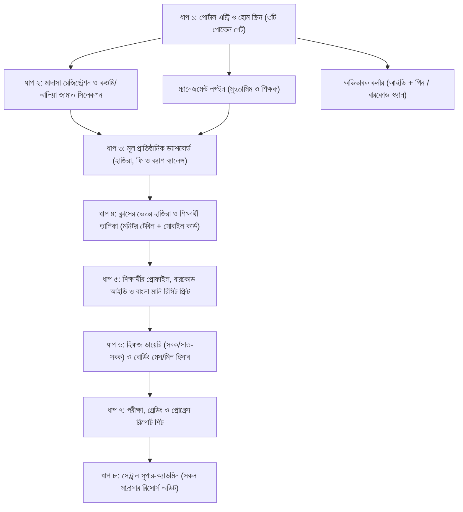

# মাদ্রাসা ম্যানেজমেন্ট ও অটোমেশন সফটওয়্যার (মাস্টার আর্কিটেকচার ও ইনফোগ্রাফিক ব্লুপ্রিন্ট)
> **প্রজেক্টের লক্ষ্য:** বাংলাদেশের কওমি ও আলিয়া সকল মাদ্রাসার জন্য একটি সমন্বিত, স্কেলেবল ও পূর্ণাঙ্গ ডিজিটাল ক্যাম্পাস প্ল্যাটফর্ম।

---

## 🏛️ ১. সিস্টেম পরিচয় ও প্রযুক্তিগত আর্কিটেকচার (Technical Stack)
* **টার্গেট স্কেল:** একক মাদ্রাসায় ১,০০০ থেকে ৫,০০০ শিক্ষার্থী এবং কেন্দ্রীয় ক্লাউডে লক্ষাধিক মাদ্রাসার মাল্টি-টেন্যান্ট (SaaS) সাপোর্ট।
* **ফ্রন্টএন্ড ইউআই/ইউএক্স:** Next.js 14+ (App Router), React, Tailwind CSS, Lucide Icons (সম্পূর্ণ মোবাইল রেসপনসিভ ও অ্যাপ-লাইক)।
* **ব্যাকএন্ড ও ডাটাবেস:** Node.js (TypeScript) API + Prisma ORM + PostgreSQL (লোকাল সার্ভারে সম্পূর্ণ কানেক্টেড ও স্কেলেবল)।
* **যোগাযোগ ও অটোমেশন:** Brevo (দৈনিক ৩০০ ফ্রি ট্রানজেকশনাল ইমেইল API) + WhatsApp Webhook ও SMS গেটওয়ে।
* **বারকোড ও প্রিন্টিং ইঞ্জিন:** ব্রাউজার ও ক্যামেরা-ভিত্তিক বারকোড স্ক্যানার, A4 সাইজ হাফ-পেপার প্রিন্ট ও POS থার্মাল স্লিপ প্রিন্টিং সাপোর্ট।

---

## 🗺️ ২. ইনফোগ্রাফিক ফ্লোচার্ট (Core System Workflow)

---

## 📋 ৩. বিস্তারিত মডিউল ও ইন্টারফেস বিশ্লেষণ (ধাপভিত্তিক চূড়ান্ত বিবরণ)

### 🚪 ধাপ ১: হোম ও পোর্টাল স্ক্রিন (The Entry Gate)
* **মনিটর ও মোবাইল লেআউট:** কোনো অতিরিক্ত ব্যাখ্যামূলক লেখার জটলা ছাড়া ৩টি প্রিমিয়াম বাটন (১২ পিক্সেল পরিমিত ব্যবধানে সাজানো)।
  1. `[ 🚀 নতুন মাদ্রাসা রেজিস্ট্রেশন ]` - নতুন প্রতিষ্ঠানের ডিজিটাল ক্যাম্পাস চালু করতে।
  2. `[ 🔐 ম্যানেজমেন্ট লগইন ]` - মুহতামিম, শিক্ষক ও কর্মচারীদের জন্য।
  3. `[ 👨‍👩‍👦 অভিভাবক কর্নার ]` - বাবা-মায়ের জন্য তাৎক্ষণিক ফলাফল ও ফি অনুসন্ধান।
* **হিডেন সুপার-অ্যাডমিন অ্যাক্সেস:** পাবলিক মেনুতে থাকবে না; কোড ও `.env` নিয়ন্ত্রিত গোপন রাউট (যেমন: `/master-control`) দিয়ে শুধু প্ল্যাটফর্ম ওনারের অ্যাক্সেস।

---

### 📝 ধাপ ২: মাদ্রাসা রেজিস্ট্রেশন ও জামাত পিকার (Registration & Setup)
* **স্প্লিট-স্ক্রিন ফর্ম:** 
  - মনিটরের বামে সুযোগ-সুবিধার মার্কেটিং প্যানেল এবং ডানে কমপ্যাক্ট ফর্ম।
  - পূর্ণ ঠিকানা এক বক্সে ক্রমানুসারে: `গ্রাম, ডাকঘর, থানা, জেলা`।
  - মাদ্রাসার নিজস্ব লিঙ্ক ও ইউনিক আইডি জেনারেশন: `madrasha.app/darul-ulum-dhaka`।
  - অফিসিয়াল মোবাইল নম্বরই ইউজারনেম, সাথে পাসওয়ার্ড এবং ঐচ্ছিক লোগো ও বেফাক/EIIN কোড।
* **ডায়নামিক জামাত সিলেকশন (বাটন পিকার):**
  - ৪টি মূল বিভাগীয় ট্যাব: `নূরানী ও নাজেরা`, `হিফজুল কুরআন`, `কওমি কিতাব বিভাগ`, `আলিয়া মাদ্রাসা`।
  - বাটনে চাপ দিলেই স্বয়ংক্রিয়ভাবে মাদ্রাসার সিলেক্টেড তালিকায় জমা হবে (যেমন: শিশু শ্রেণি থেকে দাওরায়ে হাদিস/ইফতা বা ইবতেদায়ী থেকে কামিল)।
  - শাখা (ক, খ) তৈরির সুযোগ এবং ভুল করে ডিলিট হওয়া ঠেকাতে নিশ্চিতকরণ সতর্কবার্তা (Delete Warning)।

---

### 📊 ধাপ ৩: মাদ্রাসার মূল ড্যাশবোর্ড (Central Institutional Hub)
* **৪টি লাইভ রিয়েল-টাইম পরিসংখ্যান:**
  1. মোট শিক্ষার্থী (আবাসিক ও অনাবাসিক ভাগসহ)।
  2. আজকের দৈনিক হাজিরা (উপস্থিতি শতাংশ ও অনুপস্থিত সংখ্যা)।
  3. চলতি মাসের ফি আদায় বনাম মোট বকেয়া।
  4. আজকের মোট ক্যাশ ইন হ্যান্ড (সাধারণ তহবিল ও লিল্লাহ/যাকাত ফান্ড ব্যালেন্স)।
* **কুইক অ্যাকশন বাটন:** নতুন ছাত্র ভর্তি, ফি আদায় ও রসিদ, বারকোড স্ক্যান এবং এক ক্লিকে নোটিশ/এসএমএস।
* **মোবাইল আর্কিটেকচার:** ছোট সার্চ আইকন, স্লাইড-আউট সাইডবার ড্রয়ার এবং নিচে ৫টি নেটিভ বটম মেনু (`হোম`, `ছাত্র`, `ফি`, `হিফজ`, `মেনু`)।

---

### 🏫 ধাপ ৪: ক্লাসের ভেতরের দৃশ্য (Class Inside & Attendance)
* **মনিটর ভিউ:** পরিচ্ছন্ন ৮-কলাম টেবিল (রোল, ছবি, ছাত্রের নাম, ধরণ, অভিভাবকের মোবাইল, পড়ার বর্তমান অবস্থা, ফি স্ট্যাটাস, হাজিরা ও অ্যাকশন)।
* **মোবাইল ভিউ:** জিরো সাইডওয়েজ স্ক্রোলিং! প্রিমিয়াম টাচ কার্ড—একহাতে দাঁড়িয়ে মাত্র ৩ মিনিটে পুরো ক্লাসের হাজিরা দেওয়ার ব্যবস্থা।
* **স্মার্ট শর্টকাট:**
  - ১ ক্লিকে সবার হাজিরা সম্পন্ন করার সুবিধা।
  - অনুপস্থিত ছাত্রের পাশে তাৎক্ষণিক `[ 🚨 অভিভাবককে SMS দিন ]` বাটন।
  - ফোন নম্বরের পাশে সরাসরি `[ 📞 কল ]` এবং `[ 💬 WhatsApp ]` বাটন।
  - এতিম/দরিদ্র ছাত্রদের জন্য `[ লিল্লাহ/ছাড় ]` ব্যাজ।

---

### 💳 ধাপ ৫: শিক্ষার্থীর প্রোফাইল, বারকোড আইডি ও মানি রিসিট (Financial & Profile Core)
* **স্মার্ট আইডি কার্ড:** বারকোড ও কিউআর সম্বলিত রেডি-টু-প্রিন্ট স্টুডেন্ট আইডি কার্ড।
* **অভিভাবকের গোপন ৪-সংখ্যার পিন (PIN):** রেজাল্ট ও গোপন ফি তথ্য সুরক্ষিত রাখতে ৪ ডিজিটের সহজ পিন (যেমন: `১২৩৪`)।
* **বাংলা মানি রিসিট ও পেমেন্ট ইঞ্জিন:**
  - আংশিক পেমেন্ট ট্র্যাকিং: (মোট ফি: ২০০০ | জমা: ১৫০০ | বর্তমান বকেয়া: ৫০০)।
  - ডুয়াল প্রিন্ট সাপোর্ট: সাধারণ প্রিন্টারের জন্য A4 পেপারে হাফ-সাইজ রসিদ এবং ক্যাশ কাউন্টারের জন্য ছোট POS থার্মাল পেপার স্লিপ।
  - এক ক্লিকে অভিভাবকের **WhatsApp-এ ডিজিটাল রসিদ** স্বয়ংক্রিয়ভাবে প্রেরণ।

---

## 🚀 ৪. বিরতির পর আমরা যা যা সম্পন্ন করব (Upcoming Steps)
1. **ধাপ ৬: হিফজ ডায়েরি ও বোর্ডিং মেস ব্যবস্থাপনা:**
   - হিফজের জন্য দৈনিক সবক (নতুন পড়া), সাত-সবক (বিগত পারা রিভিশন) এবং আমপারা ট্র্যাকিং।
   - আবাসিক ছাত্রদের দৈনিক খাবার মিল কাউন্ট ও বাজার খরচ হিসাব।
2. **ধাপ ৭: পরীক্ষা ও রেজাল্ট শিট:**
   - কওমি ও আলিয়া গ্রেডিং পদ্ধতি, নম্বর এন্ট্রি ও ডিজিটাল মার্কশিট প্রিন্ট।
3. **ধাপ ৮: সেন্ট্রাল সুপার-অ্যাডমিন (মাস্টার কন্ট্রোল প্যানেল):**
   - সারা দেশে কতটি মাদ্রাসা যুক্ত হলো এবং তাদের ডেটা/স্টোরেজ ব্যবহারের লাইভ সেন্ট্রাল মনিটরিং।
4. **ধাপ ৯: লোকাল সার্ভারে ডেভেলপমেন্ট ও কোডিং বাস্তবায়ন শুরু!**
